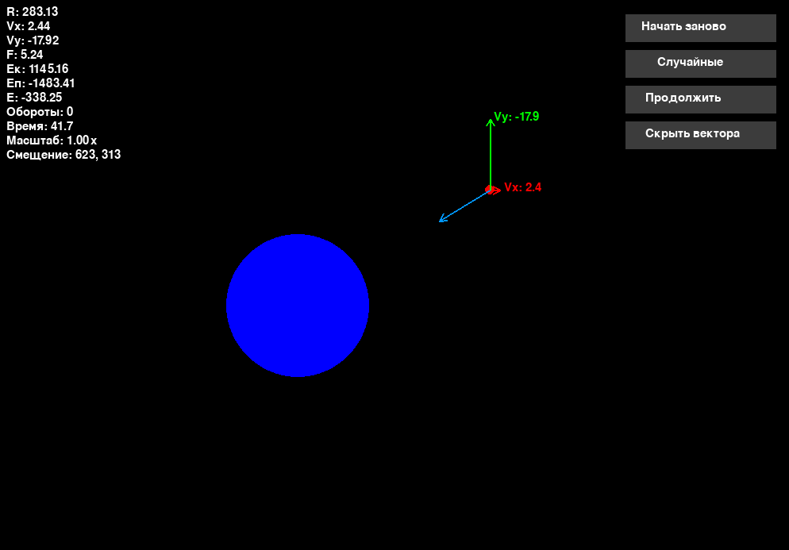

# 🌍🛰️ Gravitational Orbit Simulator (Python · Pygame)

<p align="center">
  
</p>

<p align="center">
  <b>Интерактивная 2D-симуляция орбитального движения спутника вокруг планеты</b><br>
  Закон всемирного тяготения · Энергии · Векторы · Столкновения
</p>

<p align="center">
  
  
  
  
  
</p>

---

## ✨ О проекте

**Gravitational Orbit Simulator** — это учебно-визуальный проект, демонстрирующий
движение спутника в гравитационном поле планеты в реальном времени.

Проект отлично подходит для:
- изучения **классической механики**
- визуализации **орбит и энергий**
- экспериментов с начальными условиями
- демонстрации физических законов в интерактивной форме

---

## 📸 Галерея

<p align="center">
  
  
</p>

<p align="center">
  
  
</p>

---

## 🚀 Возможности

### 🧠 Реалистичная физика
- Закон всемирного тяготения  
- Кинетическая, потенциальная и полная энергия  
- Учет массы планеты и спутника  
- Подсчёт оборотов и времени  

### 🧭 Интерактивная камера
- Панорамирование сцены мышью  
- Плавный зум колесиком  
- Отображение масштаба и смещения  

### 📐 Визуализация векторов
| Вектор | Цвет | Описание |
|------|------|---------|
| Скорость X | 🔴 | Горизонтальная компонента |
| Скорость Y | 🟢 | Вертикальная компонента |
| Сила тяготения | 🔵 | Направление и величина силы |

### 💥 Столкновения
- Обнаружение столкновения со сферой планеты  
- Коэффициент упругости `e`  
- Эффект отскока  

### 🎲 Случайные сценарии
- Генерация случайных планет и спутников  
- Быстрый перезапуск симуляции  

---

## 🎮 Управление

### ⌨️ Ввод параметров
- `Enter` — подтвердить и перейти к следующему параметру
- Последовательность ввода:
  1. Масса планеты (тонны)
  2. Масса спутника (кг)
  3. Начальная скорость X
  4. Начальная скорость Y

### 🖱️ Мышь
- **ЛКМ + перетаскивание** — перемещение камеры  
- **Колесо мыши** — масштабирование  
- **Кнопки справа** — управление симуляцией  

---

## 📊 Отображаемая статистика

| Показатель | Описание |
|---------|---------|
| Расстояние | До центра планеты |
| Скорость | По X и Y |
| Сила тяготения | Модуль |
| Энергия | Кинетическая |
| Энергия | Потенциальная |
| Энергия | Полная |
| Обороты | Количество витков |
| Время | Секунды симуляции |
| Камера | Зум и смещение |

---

## ⚙️ Основные параметры

| Параметр | Назначение |
|--------|-----------|
| `G` | Гравитационная постоянная |
| `e` | Коэффициент упругости |
| `zoom` | Масштаб камеры |
| `vx`, `vy` | Начальные скорости |
| `m_planet` | Масса планеты |
| `m_ball` | Масса спутника |

---

## 🛠 Установка и запуск

### 📥 Клонирование репозитория
```bash
git clone https://github.com/festW099/the-force-of-gravity
cd the-force-of-gravity
````

### 📦 Установка зависимостей

```bash
pip install pygame
```

### ▶️ Запуск

```bash
python main.py
```

> ✅ Рекомендуется **Python 3.9+**

---

## 🐛 Известные проблемы

* При экстремально высоких скоростях возможны численные ошибки
* В редких случаях спутник может застрять внутри планеты
* Кнопка **«начать с теми же параметрами»** временно не работает

---

⭐ Если проект оказался полезным — поставь звезду репозиторию!

---

<p align="center">
  <sub>Made with, Python & Physics</sub>
</p>
```

---
